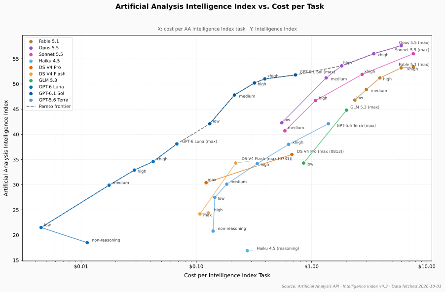
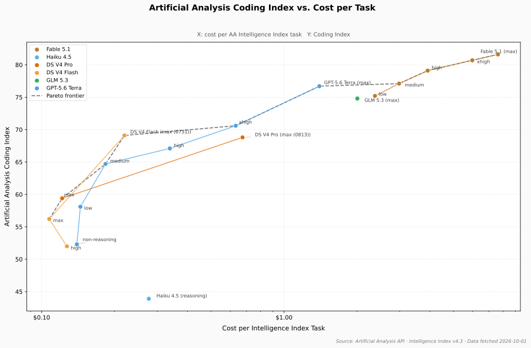

# opencode-oneprovider

OpenCode plugin for [OneProvider](https://oneprovider.dev) — unified access to Claude, DeepSeek, GLM, GPT and more with pre-configured models, token pricing, context limits, and authentication.

---

## Performance

<small>

Benchmark data from [Artificial Analysis](https://artificialanalysis.ai). X-axis: cost per AA Intelligence Index task. Run `python scripts/plot.py --refresh` to update.

</small>

**Intelligence Index vs. Cost**



**Coding Index vs. Cost**



---

## Features

- **Zero Boilerplate**: Injects `oneprovider` provider configuration into OpenCode automatically. No need to maintain huge model blocks in your `opencode.jsonc`.
- **Accurate Token Pricing**: All models are pre-configured with exact input, output, cache-read, and cache-write rates based on the [OneProvider pricing table](https://oneprovider.dev/pricing#model-rates).
- **Accurate Context Windows**: Models are configured with true context limits (up to 1M+ tokens) and appropriate output ceilings.
- **Secure Key Management**:
  - `opencode auth login` (stored in OpenCode's secure auth store)
  - `ONEPROVIDER_API_KEY` environment variable
  - Optional `provider.oneprovider.options.apiKey` override

---

## Installation

Add this plugin to your `~/.config/opencode/opencode.jsonc`:

```jsonc
{
  "$schema": "https://opencode.ai/config.json",
  "plugin": [
    "opencode-oneprovider"
  ]
}
```

Or for local development / git clone:

```jsonc
{
  "$schema": "https://opencode.ai/config.json",
  "plugin": [
    "/home/christian/git/opencode-oneprovider"
  ]
}
```

---

## Authentication

You can authenticate in any of the following ways:

### 1. Interactive Login (Recommended)

Run:

```bash
opencode auth login
```

Select **OneProvider API key** and enter your `sk-...` API key.

### 2. Environment Variable

Export `ONEPROVIDER_API_KEY`:

```bash
export ONEPROVIDER_API_KEY="sk-..."
```

### 3. Config File (Optional)

If you prefer keeping your key in `opencode.jsonc`:

```jsonc
{
  "provider": {
    "oneprovider": {
      "options": {
        "apiKey": "sk-..."
      }
    }
  }
}
```

---

## Supported Models

### Benchmark Results

<small>

Intelligence and coding scores from [Artificial Analysis](https://artificialanalysis.ai). Cost is per AA Intelligence Index task. Intel/Cost = intelligence ÷ cost (higher = better value). Models without AA data yet are omitted.

<!-- BEGIN BENCHMARK TABLE -->
| Model | Effort | Intelligence | Coding | Cost/Task | Intel/Cost |
|---|---|---|---|---|---|
| Claude Fable 5.1 | low<br>medium<br>high<br>xhigh<br>max | 46.8<br>48.9<br>51.2<br>53.2<br>53.4 | 75.2<br>77.1<br>79.1<br>80.7<br>81.6 | $2.37<br>$2.98<br>$3.91<br>$5.98<br>$7.63 | 20<br>16<br>13<br>9<br>7 |
| Claude Opus 5.5 | low<br>medium<br>high<br>xhigh<br>max | 42.3<br>51.2<br>53.6<br>56.0<br>57.6 | —<br>—<br>—<br>—<br>— | $0.551<br>$1.34<br>$1.82<br>$3.46<br>$5.98 | 77<br>38<br>29<br>16<br>10 |
| Claude Sonnet 5.5 | medium<br>high<br>xhigh<br>max | 40.7<br>46.7<br>51.9<br>56.0 | —<br>—<br>—<br>— | $0.586<br>$1.08<br>$2.74<br>$7.62 | 69<br>43<br>19<br>7 |
| Claude Haiku 4.5 | non-reasoning<br>reasoning | 15.4<br>16.9 | —<br>43.9 | —<br>$0.277 | —<br>61 |
| DeepSeek V4 Pro | non-reasoning<br>high<br>max<br>max (0813) | 20.8<br>30.1<br>30.4<br>36.0 | —<br>58.7<br>59.4<br>68.8 | —<br>—<br>$0.121<br>$0.674 | —<br>—<br>250<br>53 |
| DeepSeek V4 Flash | non-reasoning<br>high<br>max<br>max (0731) | 18.9<br>24.4<br>24.2<br>34.3 | —<br>52.0<br>56.2<br>69.1 | —<br>$0.127<br>$0.107<br>$0.220 | —<br>192<br>225<br>156 |
| GLM 5.3 | low<br>max | 34.3<br>44.8 | —<br>74.8 | $0.852<br>$2.01 | 40<br>22 |
| GPT-6 Luna | non-reasoning<br>low<br>medium<br>high<br>xhigh<br>max | 18.5<br>21.5<br>29.9<br>32.9<br>34.6<br>38.1 | —<br>—<br>—<br>—<br>—<br>— | $0.0113<br>$0.0045<br>$0.0175<br>$0.0290<br>$0.0422<br>$0.0677 | 1637<br>4778<br>1709<br>1134<br>820<br>563 |
| GPT-6.1 Sol | low<br>medium<br>high<br>xhigh<br>max | 42.1<br>47.8<br>50.2<br>51.0<br>51.8 | —<br>—<br>—<br>—<br>— | $0.131<br>$0.214<br>$0.319<br>$0.393<br>$0.724 | 322<br>224<br>157<br>130<br>72 |
| GPT-5.6 Terra | non-reasoning<br>low<br>medium<br>high<br>xhigh<br>max | 20.8<br>27.5<br>30.1<br>34.2<br>38.0<br>42.1 | 52.3<br>58.1<br>64.7<br>67.1<br>70.6<br>76.7 | $0.140<br>$0.144<br>$0.183<br>$0.338<br>$0.632<br>$1.40 | 149<br>190<br>164<br>101<br>60<br>30 |
<!-- END BENCHMARK TABLE -->

</small>

### Pricing

<small>

<!-- BEGIN PRICING TABLE -->
| Model ID | Name | Context | Output | In $/1M | Out $/1M | Cache Read | Cache Write |
|---|---|---|---|---|---|---|---|
| `oneprovider/claude-fable-5-1` | Claude Fable 5.1 | 1M | 65K | $10.00 | $50.00 | $0.25 | $12.50 |
| `oneprovider/claude-opus-5-5` | Claude Opus 5.5 | 1M | 128K | $4.00 | $20.00 | $0.20 | $5.00 |
| `oneprovider/claude-sonnet-5-5` | Claude Sonnet 5.5 | 1M | 65K | $1.00 | $5.00 | $0.10 | $1.25 |
| `oneprovider/claude-haiku-4-5` | Claude Haiku 4.5 | 204K | 8K | $1.00 | $5.00 | $0.10 | $1.25 |
| `oneprovider/deepseek-v4-pro` | DeepSeek V4 Pro | 1M | 8K | $0.66 | $1.98 | $0.022 | $0.66 |
| `oneprovider/deepseek-v4-flash` | DeepSeek V4 Flash | 1M | 8K | $0.22 | $0.66 | $0.007 | $0.22 |
| `oneprovider/glm-5.3` | GLM 5.3 | 1M | 131K | $1.40 | $4.40 | $0.26 | $1.40 |
| `oneprovider/glm-5.3-flash` | GLM 5.3 Flash | 1M | 131K | $0.15 | $0.50 | $0.03 | $0.15 |
| `oneprovider/gpt-6-luna` | GPT-6 Luna | 1M | 128K | $0.10 | $0.50 | $0.01 | $0.125 |
| `oneprovider/gpt-6.1-sol` | GPT-6.1 Sol | 1M | 128K | $2.00 | $10.00 | $0.10 | $2.00 |
| `oneprovider/gpt-5.6-terra` | GPT-5.6 Terra | 1M | 128K | $2.50 | $15.00 | $0.25 | $3.125 |
<!-- END PRICING TABLE -->

</small>

---

## License

MIT
